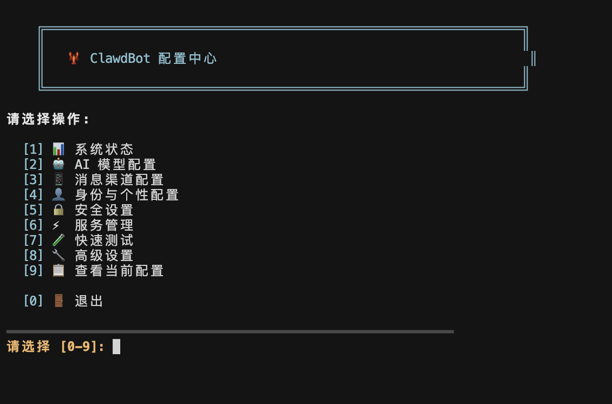

# 🦞 OpenClaw Lightweight installer

  
  
  

> 🚀 **One-click deployment for your private AI assistant.** Supports multi-platform integration and multiple LLM backends.

## 💻 Requirements

| Component | Requirement |
| --- | --- |
| **OS** | macOS 12+ / Windows 10+ |
| **Runtime** | **None** (bundled in installer) for Mac/Win. |
| **Hardware** | Min 2GB RAM (4GB+ Recommended), 1GB Disk |

## 📥 Installation

Download the latest installer for your platform from the **[Releases](../../releases)**.

### 🍎 macOS (DMG)

1. **Download** the `OpenClaw_macOS.dmg` file.
2. **Open** the file and drag the **OpenClaw** icon to your **Applications** folder.
3. **Run** OpenClaw from your Applications folder to initialize.
* *Note: If you see a security warning, right-click the app and select "Open".*

4. The `openclaw` command is now available in your terminal.

### 🪟 Windows (EXE)

1. **Download** the `OpenClaw_x64.exe` file.
2. **Run** the installer.
3. Open **OpenClaw**.

---

## ✨ Features

### 🤖 AI Models

* **Commercial:** Anthropic Claude (Sonnet/Opus), OpenAI GPT-4o, Google Gemini.
* **Gateways:** OpenRouter (One key for all models).
* **Fast Inference:** Groq, Mistral AI.
* **Local:** Ollama (Llama 3, Mistral) - *Private & Offline.*

> **Note:** Custom API Base URLs are supported (e.g., OneAPI/NewAPI).

### 📱 Channels

* **Instant Messaging:** Telegram, Discord, WhatsApp, Slack, WeChat, Feishu.
* **Apple:** iMessage (macOS only).

### 🧠 Core Capabilities

* **Memory:** Persistent long-term memory.
* **Automation:** Scheduled tasks and alerts.
* **Skills:** Extend functionality via Markdown.
* **Control:** System command execution and file I/O.

## ⚙️ Configuration Guide

After installation, run the setup wizard:

* **Mac/Linux:** `openclaw onboard` or `./config-menu.sh`
* **Windows:** `openclaw onboard`

### 1. AI Providers

Select `[2] AI Model Config`.

* **Official:** Enter API Key.
* **Custom Proxy:** Enter **Base URL** first, then API Key.

### 2. Platform Setup

| Platform | Quick Setup Steps |
| --- | --- |
| **Telegram** | Create via `@BotFather` → Get **Bot Token** → Get **User ID** via `@userinfobot`. |
| **Discord** | Developer Portal → Create App → Bot Menu → Reset Token → **Enable Message Content Intent**. |
| **WhatsApp** | Select in menu → Scan QR code in terminal. |
| **Feishu** | Create App → Enable Bot → Use **WebSocket** mode (No IP needed). |

## 📝 Command Cheat Sheet

| Action | Command |
| --- | --- |
| **Start Service** | `openclaw gateway start` |
| **Stop Service** | `openclaw gateway stop` |
| **View Logs** | `openclaw logs --follow` |
| **Config Menu** | `openclaw onboard` |
| **Check Health** | `openclaw doctor` |
| **Backup Data** | `openclaw backup` |

## 🛡️ Security Best Practices

* **Isolation:** Deploy on a dedicated server or VM if possible.
* **Sandboxing:** Enable `sandbox_mode: true` in config.
* **Access Control:** Strictly define `allowed_users` in channel configurations.

## ❓ Troubleshooting

* **"Unverified Developer" (macOS):** Go to System Settings → Privacy & Security → scroll down and click "Open Anyway".
* **Command Not Found (Windows):** Restart your terminal (PowerShell/CMD) after installation to refresh the PATH.
* **Connection Failed:** Check `openclaw logs` and ensure your firewall allows outgoing connections.

---
